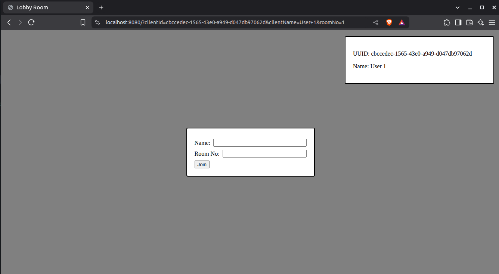
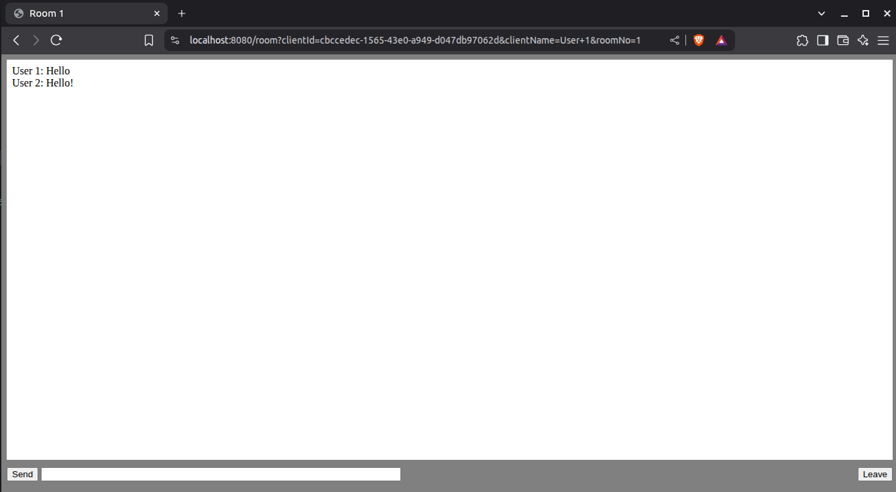
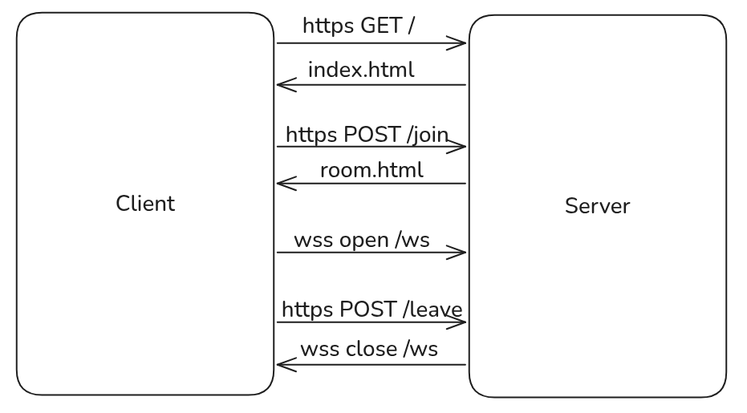

# Go WebSocket Chat Server
Simple Go server Chat server with a simple front end. Use of Websockets to send messages to rooms.
<br>
Features:
* Server contains a bunch of rooms for clients to join and leave
* Clients can join, write messages and leave the rooms
* Room session state is retained until server is stopped




## Architecture diagram


## Setup
Run the following commands to create and sign the certficate
1. ```openssl genrsa -out tls/server.key 2048```
2. ```openssl req -new -x509 -sha256 -key tls/server.key -out tls/server.crt -days 3650 -config req.cnf```
3. Go to your browsers certificate settings and add the .crt as a trusted certificate

Start Go server: ```go run .```

## References
* https://github.com/gorilla/websocket/tree/main/examples/chat
* https://github.com/denji/golang-tls
